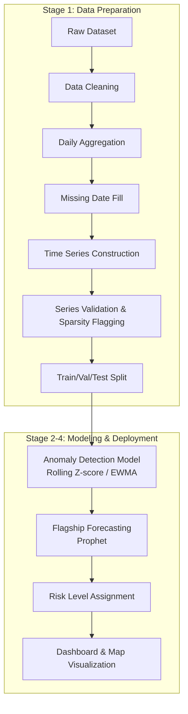

# AI-Based Early Outbreak Detection System

[](https://www.python.org/)
[](LICENSE)
[](https://github.com/abinannd/warning)
[](https://abinannd.github.io/warning/)

An AI-based early warning system that detects unusual infectious disease patterns before they escalate into outbreaks.

Live demo: [https://abinannd.github.io/warning/](https://abinannd.github.io/warning/)

## Overview

Public health agencies often face delays in detecting emerging infectious disease threats because early-warning signals can be hidden in fragmented surveillance data. This project addresses that problem by proposing an AI-based early outbreak detection system that identifies unusual increases in disease cases before they escalate into larger outbreaks.

The system collects anonymized and aggregated case counts from hospitals and health centers, including daily or weekly reports for illnesses such as fever, dengue, influenza, and other infectious diseases. It learns the normal patterns of disease occurrence for each region from historical surveillance data and continuously analyzes new data for abnormal spikes, sustained growth trends, seasonal deviations, and geographic clustering. When an unusual pattern is detected, it generates an early warning with a risk level of Low, Medium, or High and visualizes the affected locations on an interactive dashboard and map. Because access to real-time hospital data is restricted by privacy concerns, the prototype uses publicly available historical disease datasets and IDSP outbreak reports to replay historical outbreaks and evaluate how early the system can detect warning signs.

## Key Features

- Rolling Z-score and EWMA-based anomaly detection per district-disease pair
- Prophet-based forecasting for selected high-priority time series
- Risk-level classification (Low / Medium / High)
- Interactive map-based dashboard for outbreak visualization
- Chronological train/validation/test split for realistic backtesting

## System Architecture / ML Pipeline




## Stage-wise Reports

| Stage | Description | Report |
|-------|-------------|--------|
| 1 | Data Preparation & Preprocessing | [View Report](ai/reports/stage_wise_reort/STAGE1_README.md) |
| 2 | Time Series Construction & Validation | [View Report](ai/reports/stage_wise_reort/STAGE2_README.md) |
| 3 | Anomaly Detection & Forecasting Model | [View Report](ai/reports/stage_wise_reort/STAGE3_README.md) |
| 4 | Dashboard, Risk Mapping & Deployment | [View Report](ai/reports/stage_wise_reort/STAGE4_README.md) |

<details>
<summary>Stage 1 sub-step checklist</summary>

- [ ] Load & validate dataset
- [ ] Clean data
- [ ] Aggregate to daily counts
- [ ] Fill missing dates
- [ ] Construct individual time series
- [ ] Validate time series
- [ ] Flag sparse series
- [ ] Chronological train/val/test split (2018-2023 / 2024 / 2025)
- [ ] Save outputs

</details>

## Tech Stack

- Backend/ML: Python, Pandas, NumPy, Prophet, scikit-learn
- Visualization: Plotly, Leaflet, or Google Maps JavaScript API
- Frontend: HTML, CSS, and JavaScript

## Getting Started

1. Clone the repository.

   ```bash
   git clone https://github.com/abinannd/<repo-name>.git
   ```

2. Navigate into the project directory.

   ```bash
   cd <repo-name>
   ```

3. Create and activate a virtual environment.

   ```bash
   python -m venv .venv
   source .venv/bin/activate
   <!-- update command -->
   ```

4. Install dependencies.

   ```bash
   pip install -r requirements.txt
   ```

5. Set up environment variables.

   ```bash
   cp .env.example .env
   ```

   Add a Google Maps API key to the environment file:

   ```env
   GOOGLE_MAPS_API_KEY=your_key_here
   ```

6. Run the data pipeline or backend service.

   ```bash
   <!-- update command -->
   ```

7. Start the local server and open the application.

   ```bash
   python app.py
   ```

   Open http://localhost:5000 in a browser, or adjust the port as needed.

## Dataset & Credits


## Future Enhancements

- Integrate real-time hospital and clinic data feeds via secure APIs, subject to privacy and regulatory approval
- Extend per-series forecasting from flagship diseases to the full district-disease matrix using scalable Prophet or deep learning models (e.g., LSTM, Temporal Fusion Transformer)
- Incorporate spatial clustering (e.g., DBSCAN or Moran's I) to detect multi-district outbreak spread patterns
- Add automated SMS/email alerts to health authorities when a High risk level is triggered
- Support multilingual dashboard (Malayalam, English) for wider accessibility among local health workers
- Expand dataset coverage beyond Kerala to other states using IDSP data integration
- Add model explainability (e.g., SHAP) to help health officials understand why an alert was raised
- Introduce a feedback loop where confirmed/false outbreak alerts are used to retrain and improve model accuracy
- Deploy as a scalable cloud-based service with role-based access for district health officers
- Mobile app version for field health workers to report cases and view alerts on the go


### Credits

- Dataset source: Kerala Department of Health & Family Welfare, accessed through the official health data portal: [https://health.kerala.gov.in/](https://health.kerala.gov.in/). The data was used solely for prototype and research purposes under the hackathon context.
- Mapping visualization is powered by the Google Maps Platform via the Google Maps JavaScript API, and any deployment must retain the required attribution as specified by Google Maps terms of use.
- IDSP (Integrated Disease Surveillance Programme) outbreak reports were used as a secondary reference source. [https://ihip.mohfw.gov.in/idsp/#/home-page](https://ihip.mohfw.gov.in/idsp/#/home-page)

## Disclaimer

This repository contains a hackathon prototype built on publicly available historical data. It is not connected to live hospital systems and is not intended for real-world clinical or public health deployment without further validation and operational review.

## License

This project is licensed under the MIT License. See the LICENSE file for details.

## Live Demo

Live demo: [https://abinannd.github.io/warning/](https://abinannd.github.io/warning/)
